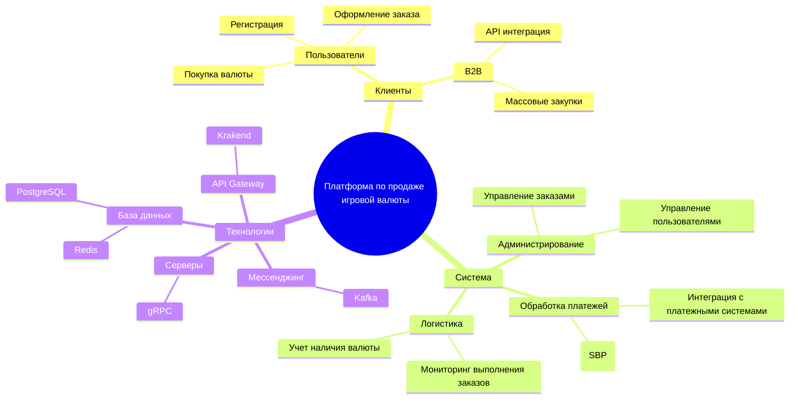
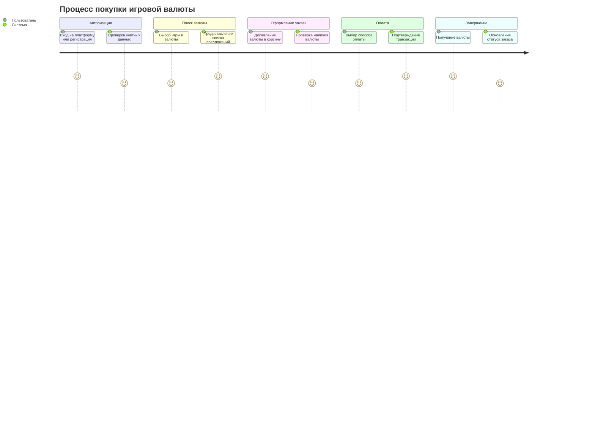
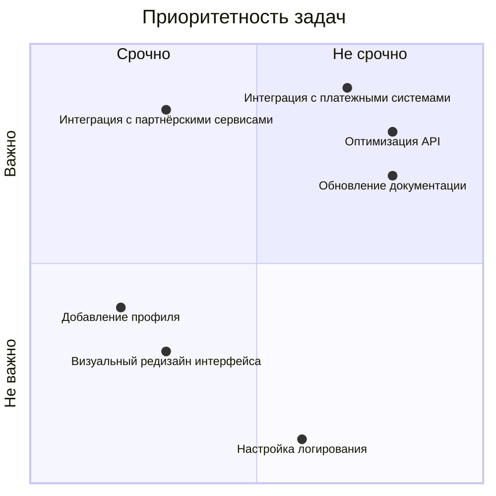
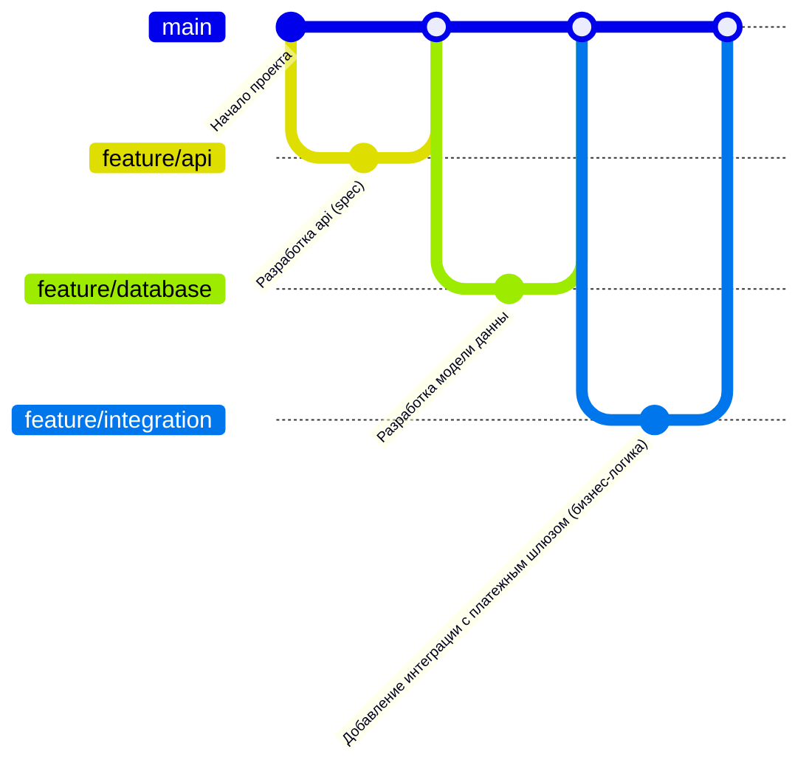

# Платформа по продаже игровой валюты

Данный проект представляет собой клиент-серверную платформу для покупки и продажи игровой валюты. В системе реализована гибкая архитектура с поддержкой интеграции для B2B и B2C клиентов, а также продуманные пользовательские сценарии для обеспечения удобства работы.

---

## 1. Функциональные возможности платформы

### Описание
Эта диаграмма демонстрирует основные функциональные возможности системы. Она охватывает:
- Возможности для конечных пользователей (регистрация, покупка, заказы).
- Административные функции (управление заказами, логистика).
- Технические компоненты, включая базы данных, API Gateway и мессенджинг.

---

## 2. Путь пользователя

### Описание
Диаграмма описывает процесс взаимодействия пользователя с системой:
1. Авторизация пользователя (вход или регистрация).
2. Поиск подходящей валюты.
3. Оформление и оплата заказа.
4. Завершение покупки и получение игровой валюты.

---

## 3. Квадрант-граф: Приоритет задач

### Описание
Квадрант-граф распределяет задачи платформы по двум осям:
- **Важность задачи**: Высокая или низкая.
- **Скорость реализации**: Быстрая или медленная.

---

## 4. История разработки

### Описание
Диаграмма отражает процесс разработки проекта:
- Создание веток для различных частей системы.
- Последовательная работа над API, моделью данных и интеграцией с платёжными шлюзами.
- Постепенное слияние веток в основную ветку `main`, чтобы интеграция была согласованной.

---

### Используемые технологии
- **База данных:** PostgreSQL для основного хранилища и Redis для кэширования.
- **API Gateway:** Krakend для обработки запросов.
- **Мессенджинг:** Kafka для асинхронного взаимодействия между компонентами.
- **gRPC:** Основной протокол взаимодействия между сервисами.

---
